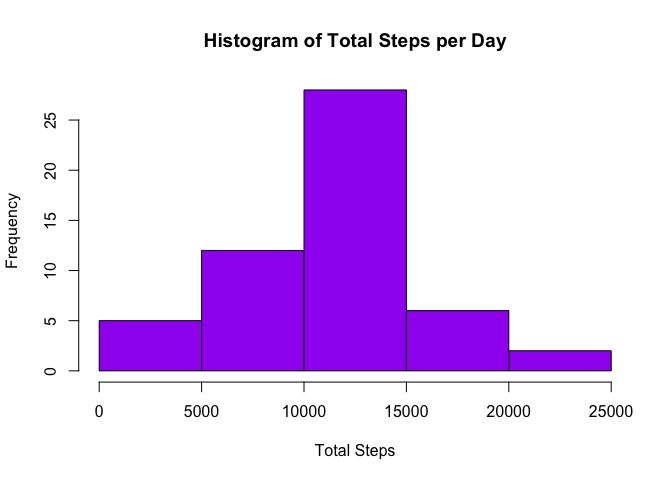
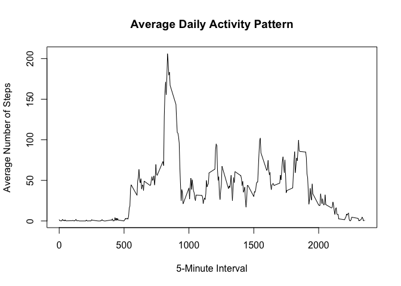
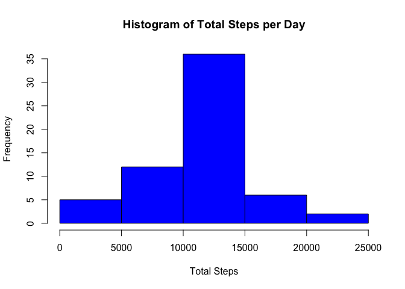
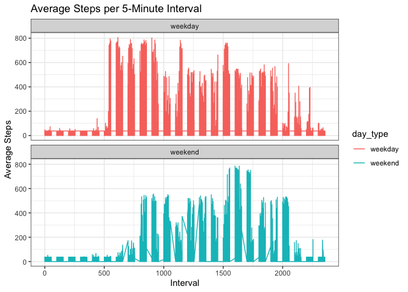

### Data Loading and Preprocessing
In this section, we load the dataset containing activity data. We use the read.csv function to read the CSV file into R and convert the 'steps' column to numeric format using the mutate function from the dplyr package.


```r
# Load the dataset
suppressMessages(library(dplyr))

activity <- read.csv("Assignment/activity.csv") %>%
        mutate(across(c(steps), as.numeric)) 
```


### What is mean total number of steps taken per day?  

This section calculates and visualizes the total number of steps taken per day. We aggregate the data by date and calculate the sum of steps for each day. Then, we create a histogram to visualize the distribution of total steps per day. Finally, we calculate and display the mean and median number of steps per day.

```r
# Summarize the total number of steps taken per day
steps_per_day <- aggregate(steps ~ date, data = activity, FUN = sum)

# Create a histogram of the total number of steps taken each day
hist(steps_per_day$steps, main = "Histogram of Total Steps per Day", xlab = "Total Steps", ylab = "Frequency", col = "purple")
```

<!-- -->

```r
# Calculate and report the mean and median of the total number of steps taken per day
mean_steps <- mean(steps_per_day$steps)
median_steps <- median(steps_per_day$steps)

cat("Mean steps per day:", mean_steps, "\n")
```

```
## Mean steps per day: 10766.19
```

```r
cat("Median steps per day:", median_steps, "\n")
```

```
## Median steps per day: 10765
```


### What is the average daily activity pattern?  

This section analyzes the average daily activity pattern by grouping the data by 5-minute intervals and calculating the average number of steps for each interval. We visualize the results using a time series plot and identify the interval with the maximum average number of steps.


```r
# Group the data by 5-minute interval and calculate the average number of steps
avg_steps <- aggregate(steps ~ interval, data = activity, FUN = mean)

# Create a time series plot
plot(avg_steps$interval, avg_steps$steps, type = "l", 
     main = "Average Daily Activity Pattern", xlab = "5-Minute Interval", ylab = "Average Number of Steps")
```

<!-- -->

```r
# Identify the interval with the maximum average number of steps
max_interval <- avg_steps$interval[which.max(avg_steps$steps)]
max_avg_steps <- max(avg_steps$steps)

cat("Interval with the maximum average number of steps:", max_interval, "\n")
```

```
## Interval with the maximum average number of steps: 835
```

```r
cat("Maximum average number of steps in the interval:", max_avg_steps, "\n")
```

```
## Maximum average number of steps in the interval: 206.1698
```


### Imputing missing values. 

This section addresses missing values in the dataset. We first count the total number of missing values. Then, we impute missing values using the mean value of steps for each day. After imputation, we re-summarize the total steps per day, create a histogram to visualize the distribution with imputed values, and calculate the mean and median steps per day.


```r
# Calculate the total number of missing values
total_missing_values <- sum(is.na(activity))

# Report the total number of missing values
cat("Total number of missing values in the dataset:", total_missing_values, "\n")
```

```
## Total number of missing values in the dataset: 2304
```

```r
# Calculate the mean for each day
mean_value <- round(mean(activity$steps, na.rm = TRUE))
new_activity <- activity

# Loop through each row
for (i in 1:nrow(new_activity)) {
  # If interval is NA, replace it with the mean interval for that day
  if (is.na(new_activity$steps[i])) {
    new_activity$steps[i] <- mean_value
  }
}

# Summarize the total number of steps taken per day
new_steps_per_day <- aggregate(steps ~ date, data = new_activity, FUN = sum)

# Create a histogram of the total number of steps taken each day
hist(new_steps_per_day$steps, main = "Histogram of Total Steps per Day", xlab = "Total Steps", ylab = "Frequency", col = "blue")
```

<!-- -->

```r
# Calculate and report the mean and median of the total number of steps taken per day
mean_steps <- mean(new_steps_per_day$steps)
median_steps <- median(new_steps_per_day$steps)

cat("Mean steps per day:", mean_steps, "\n")
```

```
## Mean steps per day: 10751.74
```

```r
cat("Median steps per day:", median_steps, "\n")
```

```
## Median steps per day: 10656
```


### Are there differences in activity patterns between weekdays and weekends?  

This section examines differences in activity patterns between weekdays and weekends. We categorize each day as either a weekday or a weekend based on the day of the week. Then, we summarize the data by interval and day type, calculating the average number of steps. Finally, we create a panel plot to visualize the average steps per 5-minute interval for weekdays and weekends separate


```r
# Load necessary packages
library(dplyr)
suppressMessages(library(ggplot2))
suppressMessages(library(lubridate))


# Convert the 'date' column to Date format
new_activity$date <- as.Date(new_activity$date)

# Now, you can use weekdays() function
weekday_names <- weekdays(new_activity$date)

# Step 1: Create a new factor variable indicating weekday or weekend
new_activity$day_type <- ifelse(weekday_names %in% c("Saturday", "Sunday"), "weekend", "weekday")
new_activity$day_type <- factor(new_activity$day_type, levels = c("weekday", "weekend"))

# Step 2: Summarize data by interval, averaging steps for weekdays and weekends separately
summary_data <- new_activity %>%
  group_by(interval,day_type, date) %>%
  summarise(avg_steps = mean(steps, na.rm = TRUE), .groups = "drop")

# Step 3: Create a panel plot with time series of average steps for weekdays and weekends
ggplot(summary_data, aes(x = interval, y = avg_steps, group = day_type, color = day_type)) +
  geom_line() +
  facet_wrap(~day_type, ncol = 1) +
  labs(title = "Average Steps per 5-Minute Interval",
       x = "Interval",
       y = "Average Steps") +
  theme_bw()
```

<!-- -->

